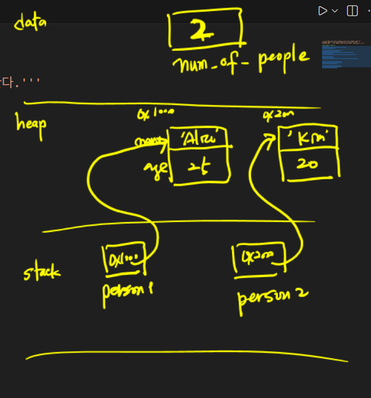

- class : 객체를 생성하는 위한 정의, 붕어빵 틀

- object: 인스턴스를 참조하는 변수, 붕어빵

- instance : **특정클래스**에서 객체화 된 실제 메모리에 할당된 것
  
  > object는 넓은 범위로, instance는 좁은 범위
  
  ```python
  class Person():
      pass
  
  p1 = Person()
  ```

- 객체
  
  - 변수(속성, 멤버변수) : 객체의 특정한 값    
    
    - 인스턴스 변수 : 생성자(__init__)에 정의된 변수(self.name)(`인스턴스이름.변수`)
    
    - 클래스 변수 : 클래스안에 전역변수 처럼 정의(` 클래스이름.변수`)
  
  - 메소드(멤버 함수) : 행동, 함수
    
    - 생성자 : 객체의 변수 값을 초기화 하는 메소드, `클래스이름()`으로 init()로 정의
    
    - 인스턴스 메소드 :  매개변수(self)
    
    - 클래스 메소드 : 매개변수(cls), 데코레이트 @classmethod
    
    - 스태틱 메소스 : 매개변수 없음. @staticmethod

- 메모리 영역
  
  - 코드(code) : 프로그램이 저장
  
  - 정적(data) : 전역변수, 정적변수, 클래스 변수
  
  - 힙(heap) : 동적 메모리, 객체들, list, dict, 
  
  - 스택(stack) : 지역변수

- 예제

```python
class Person:
    # 클래스변수, 인스턴스가 생성될 때마다 증가
    number_of_people = 0 

    # 생성자, 인스턴스 생성시 자동 호출
    def __init__(self, name, age):
        self.name = name            # self.name 인스턴스 변수
        self.age = age
        Person.number_of_people += 1    # 인스턴스 생성시 마다 증가

    # 인스턴스 메소드
    def introduce(self):
        print(f'제 이름은 {self.name}이고, 저는 {self.age}살 입니다.')


person1 = Person("Alice", 25)  # 생성자
person1.introduce() # 인스턴스.메소드()
print(Person.number_of_people)

person2 = Person("Kim", 20)  # 생성자
person2.introduce() # 인스턴스.메소드()
print(Person.number_of_people)
```


