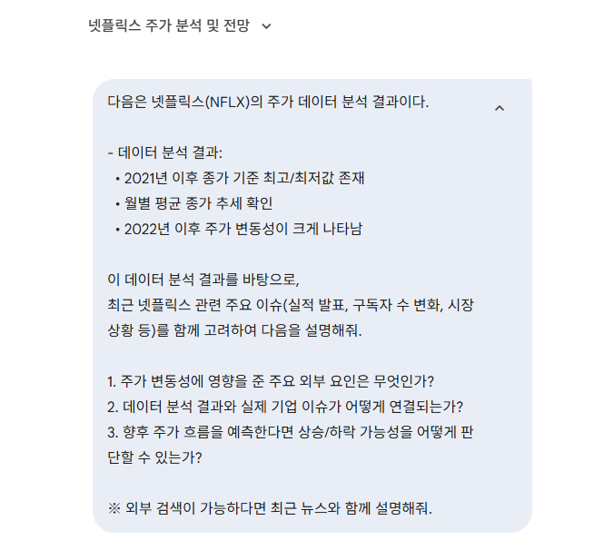
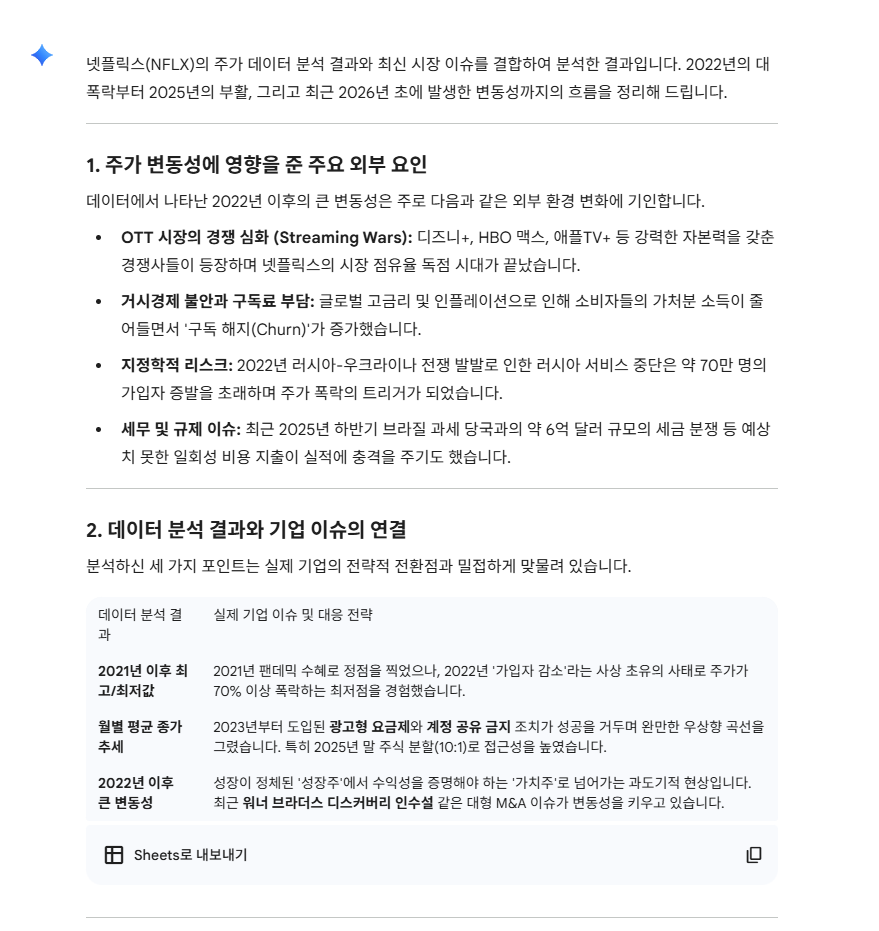
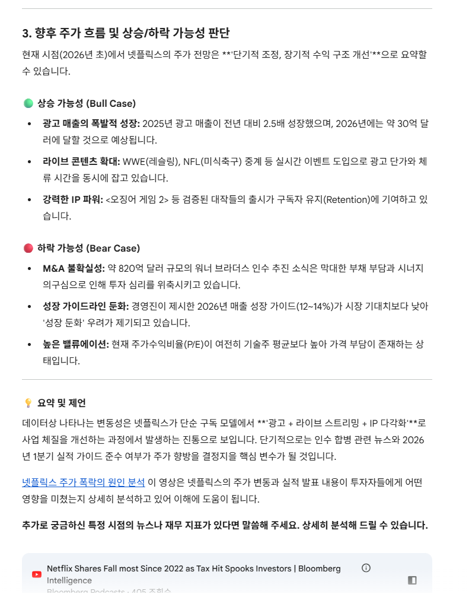

# 📊 넷플릭스 주가 데이터 분석 프로젝트 (PJT 02)

## 1. 프로젝트 개요

본 프로젝트는 Kaggle에서 제공하는 넷플릭스 주가 데이터를 활용하여 데이터 전처리, 분석, 시각화의 전체 흐름을 학습하는 것을 목표로 한다. Pandas와 Matplotlib을 활용한 시계열 데이터 분석과 생성형 AI를 활용한 데이터 해석까지 경험하였다.

---

## 2. 개발 환경

* **Language**: Python
* **Tool**: Jupyter Notebook
* **Library**: pandas, numpy, matplotlib

---

## 3. 데이터 및 사용 컬럼

* **데이터 출처**: Kaggle – Netflix Stock Price Prediction
* **사용 컬럼**: Date, Open, High, Low, Close

---

## 4. 단계별 구현 내용

### 4.1 데이터 로드 및 전처리 (F202)

* Pandas의 `read_csv()`를 사용하여 CSV 파일을 불러왔다.
* `usecols` 옵션을 활용해 분석에 필요한 컬럼만 선택하였다.

### 4.2 날짜 필터링 및 시각화 (F203)

* Date 컬럼을 `datetime` 타입으로 변환하였다.
* 2021년 이후 데이터만 필터링하여 종가(Close)를 시계열 그래프로 시각화하였다.

### 4.3 최고 / 최저 종가 추출 (F204)

* 2021년 이후 데이터에서 종가 기준 최고값과 최저값을 계산하였다.

### 4.4 월별 평균 종가 분석 (F205)

* 월 단위로 데이터를 그룹화하여 평균 종가를 계산하였다.
* 계산 결과를 그래프로 시각화하여 월별 추세를 확인하였다.

### 4.5 월별 최고 / 최저 / 종가 복합 시각화 (F206)

* 2022년 이후 데이터를 기준으로 월별 최고가, 최저가, 종가를 하나의 그래프로 표현하였다.

### 4.6 생성형 AI 활용 (F211)

* 분석 결과를 바탕으로 생성형 AI(OpenAI, Gemini 등)에 주가 해석 및 매수·매도 판단 관점의 프롬프트를 구성하였다.

---

## 5. 어려웠던 부분

* CSV 파일 경로 설정 및 컬럼 인식 과정에서 오류가 발생하여 원인을 파악하는 데 어려움이 있었다.
* Date 컬럼을 기준으로 연도별 데이터를 필터링할 때 datetime 타입 변환의 필요성을 이해하는 데 시간이 걸렸다.
* 월별 데이터 그룹화 과정에서 `groupby()`와 인덱스 처리 방식이 처음에는 익숙하지 않았다.

---

## 6. 새로 배운 것들

* `usecols` 옵션을 활용하여 필요한 컬럼만 선택해 데이터를 불러오는 방법
* `to_datetime()`을 이용한 날짜 데이터 전처리 방법
* `groupby()`와 `agg()`를 활용한 월별 통계 분석 방법
* Matplotlib을 활용한 시계열 데이터 및 복합 그래프 시각화 방법

---

## 7. 느낀 점

이번 프로젝트를 통해 데이터 분석의 전반적인 흐름을 이해할 수 있었으며, 전처리와 시각화의 중요성을 체감하였다. 또한 생성형 AI를 활용하여 데이터 해석을 확장할 수 있다는 점이 인상 깊었다.

